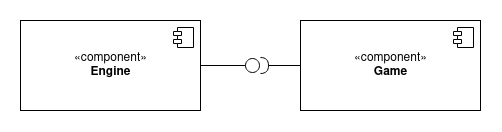
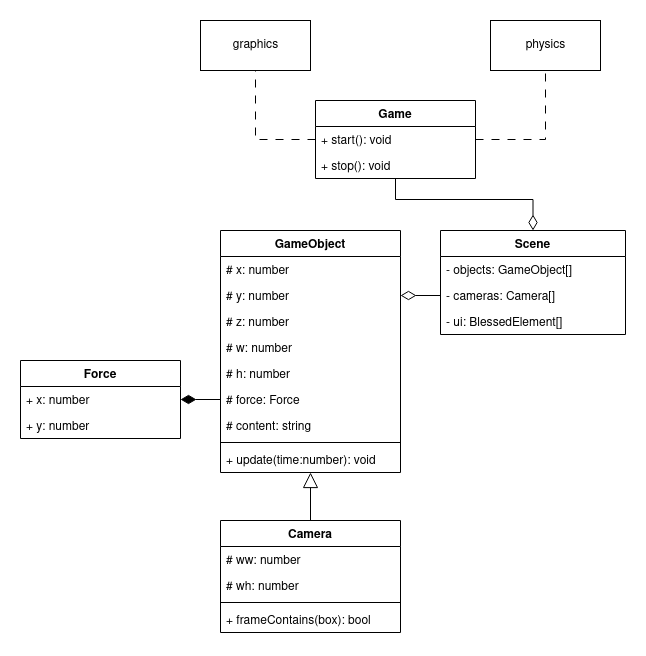
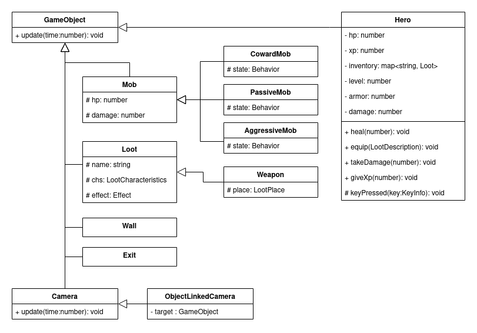
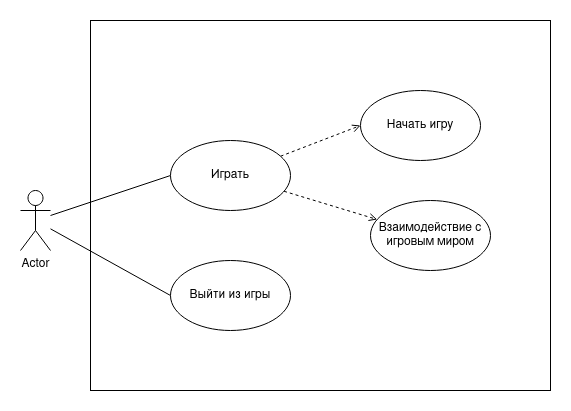
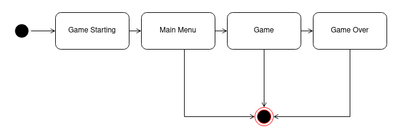

# RogueLike-ts

## Общие сведения о системе 

Данный документ описывает архитектуру приложения-игры RogueLike, в котором игрок может управлять персонажем, перемещаясь по миру, где персонаж игрока может находить различные предметы или мобов - обитателей мира, с которыми можно сражаться.

Представлена возможность влиять на характеристики персонажа посредством экипировки. Характеристики влияют на боевую систему. 

Представлена возможность влиять на характеристики персонажа посредством получение опыта за побежденных мобов. 

Главное меню предоставляет возможность ввести никнейм игрока и начать игру.

## Компоненты

Основные компоненты из которых состоит игра:

+ Игровой движок *engine*
+ Геймплей *game*

**engine** - компонента включает в себя получение сигналов от пользователя, компоновку игровых элементов, обработку физики между элементами и отрисовку элементов на экран пользователя.

**game** - содержит игровые сущности и их бизнес логику. Содержит описание пользовательских экранов.

## Структура engine

Класс **Game** служит фасадом для движка, соответственно и точкой входой является функция main запускающая, инициализирующая **Game** и запускающая её работу. Имеет 2 основных метода:

* **Start** - запустить *game loop* и начать отрисовку.
* **Stop** - остановить *game loop*, прекратить отрисовку.

При запуске **Game** инициализируется и запускается *game loop* представляет из себя функцию, которая вызывается раз в 100 миллисекунд. Соответственно, этот таймер используется для обновления состоянии игры и отрисовки.     

Внутри себя game полагается на 2 объекта - physics и graphics. Внутри game loop вызывается сперва physics, который просчитывает физику объектов (то есть их перемещение и коллизию), затем graphics, который по коллекции объектов способен вывести представление игры на экран пользователя.

Класс **Scene** агрегирует в себе UI компоненты, игровые объекты и камеры. В конкретный момент **Game** оперирует ровно одной сценой. При этом сцены можно менять. **Scene** предоставляет объекты, которые обрабатываются в *game loop*.

Класс **GameObject** является представлением объекта из игрового мира. У него есть координаты в двух мерном пространстве. Координата Z, показывающая номер слоя, на котором находится объект (Слой с большим индексом "загораживает" объекты слоя с меньшим индексом). Размер объекта (w - ширина, h - высота). На объект может действовать сила **Force**.  **Force** содержит вектор силы, который действует на объект. Поле content отвечает за графику. Содержит символы, которые будут отрисованы.

У **GameObject**'а есть метод *update*. Данный метод вызывается на каждый тик *game loop*'а. В нем удобно определять логику поведения объекта.

Класс **Camera** является игровым объектом, при этом устанавливает связь между экраном пользователя и игровым миром. То есть переводит координаты объектов из представления в игровом мире в экранные координаты. Игровой движок и объект graphics использует камеры со сцены для отрисовки игровых объектов.

## Структура game

Для наполнения игры были выделены следующие сущности. 

Класс **Hero** представляет персонажа, управляемого игроком. Объект данного класса имеет аттрибуты здоровья, опыта, уровня, инвентарь. Так же численные характеристики урона и защиты. У объекта есть публичные методы для изменения данных параметров. 

Перегрузка метода *keyPressed* позволяет задать поведения объекта в зависимости от команд пользователя.

Класс **Mob** является абстракцией для NPC. Класс содержит значения hp моба и урон, который моб наносит.

Класс **Loot** представляет собой предмет, который можно использовать (допустим положить в инвентарь или получить эффект от его использования). 

Класс **Wall** служит для того, чтоб ограничить комнаты. Его задача - запретить движение персонажа или моба на клетку, где он находится. Класс **Exit** служит переходом на следующий уровень. При коллизии игрока с этим объектом происходит переход.

В игре используется **ObjectLinkedCamera**. В конструкторе указывается объект за которым данная камера будет следовать, держа указанный объект в центре viewport'а. Внутри игры экземпляр данного класса привязан к игроку.

## Генерация карты

В программе присутствует генератор карты. По сути это одна функция, которая принимает на вход параметры - размеры карты, количество мобов и лута. И возвращает набор GameObject'ов, которые представляют собой стены, мобов, игрока и лут. 

Результат работы этой функции загружается в сцену, которая передается в объект класса Game.

## Роли и сценарии взаимодействия

Пользователь может играть единственную роль - роль игрока.

## Состояния

Пользователь запускает игру. Появляется приветственный экран. Пользователь вводит свой никнейм, после чего попадает в игру. Если hp игрока опускаются меньше нуля - пользователь проигрывает и появляется экран конца игры.

Из любого состояния пользователь может выйти из игры нажатием клавиши `escape`.

